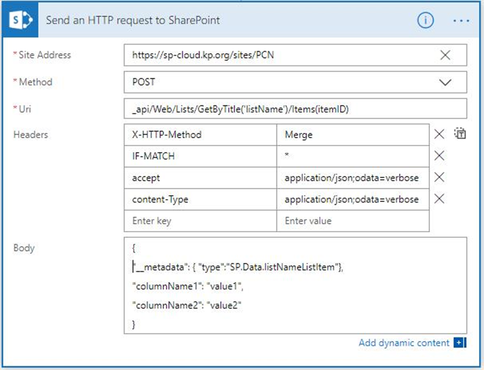

# Update a SharePoint List using REST API

## Summary
An alternate way to update a SharePoint list especially when there are required columns on the list and only one or two columns are to be updated.



## Requirements
1. **`Site Address`**
   1. Syntax: ```https://sp-cloud.kp.org/sites/siteName```
   2. Change `siteName` to a correct (your) site name
1. **`Method`** set to ```POST```
1. **`Uri`**
   1. `listItem` to the name of your list. If the list's name has spaces, use %20 for each space
   1. `itemId` to `@{triggerBody()?['ID']}`

1. **`Body`**
   1. `SP.Data.listNameListItem` - change the `listName` part to your list name
   1. `columnName1` to the first column name
   1. `value1` to the desired value for column 1
   1. you can continue listing more columns. Make sure to use commas to separate the pairs. Make sure to remove the comma if you are updating just one column.

### Author
- Riu Baring

## Version History
Version|Date|Comments
-------|----|--------
1.0|January 8, 2020|Initial release

## Disclaimer
**THIS CODE IS PROVIDED *AS IS* WITHOUT WARRANTY OF ANY KIND, EITHER EXPRESS OR IMPLIED, INCLUDING ANY IMPLIED WARRANTIES OF FITNESS FOR A PARTICULAR PURPOSE, MERCHANTABILITY, OR NON-INFRINGEMENT.**

## Additional Notes
None
